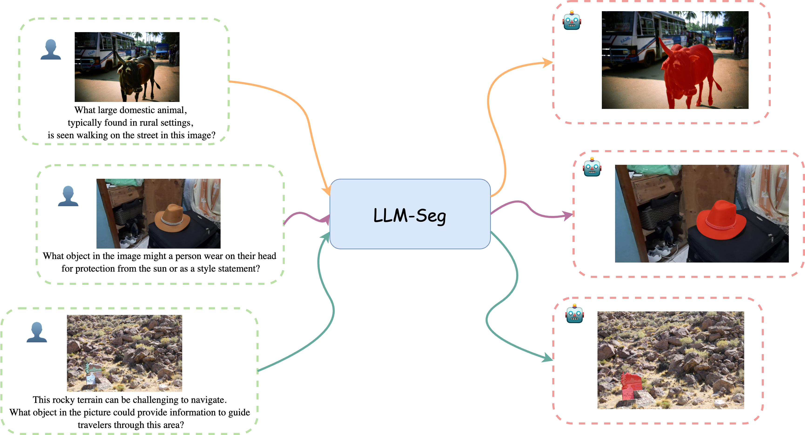

# LLM-Seg: Bridging Image Segmentation and Large Language Model Reasoning

This is the official repository for the paper "LLM-Seg: Bridging Image Segmentation and Large Language Model Reasoning" (CVPR Workshop 2024).

Our project is based on [LISA](https://github.com/dvlab-research/LISA). We thank the authors for their great work.

## Overview
LLM-Seg is a reasoning segmentation model that combines SAM and LLaVA. We also release our proposed LLM-Seg40K dataset, which is a new reasoning segmentation dataset that is generated by ChatGPT. 

### Reasoning Segmentation


### Model Architecture


## Experiment Results
The table below shows the performance of LLM-Seg on ReasonSeg validation set.


## Prepare the environment
We recommend using conda to create a virtual environment and install the dependencies.
```bash
pip install -r requirements.txt
pip install flash-attn --no-build-isolation
```


## Preparing the dataset
Please first refer to the [LISA](https://github.com/dvlab-research/LISA?tab=readme-ov-file#training-data-preparation) repository to download all the datasets.

After downloading the dataset, you can use the python script from `prepare_datasets.py` to preprocess the different dataset. The script will extract SAM Everything masks and save them as h5 files.

```bash
python prepare_datasets/prepare_<dataset_name>.py
```

After preprocessing all datasets, run the following script to convert the h5 files to json files.

```bash
python prepare_datasets/convert_h5_to_json.py
```

## Prepare the pretrained models
Please follow the [instruction](https://github.com/haotian-liu/LLaVA/blob/main/docs/MODEL_ZOO.md) to merge the LLaVA delta weights. We use `LLaVA-lightning-7B-v1` checkpoint.

For the SAM checkpoint, please use the following  [link](https://dl.fbaipublicfiles.com/segment_anything/sam_vit_h_4b8939.pth).


## Training the model
We provide some of the training scripts under the `scripts` directory. You can modify the scripts to train the model with different configurations.

For example, to train the model for 10 epochs with 2 GPUs, you can run use `train_10epoch.sh` script. You should use your own paths for the dataset, pretrained models, and log directory.

```bash
#! /bin/bash
llava_path="./pretrained_weights/LLaVA-lightning-7B-v1/"
sam_path="./pretrained_weights/SAM/sam_vit_h_4b8939.pth"
dataset_path="./lisa_dataset"
sam_masks_path="./processed_data"
log_path="./runs"

deepspeed --include localhost:6,7 \
  --master_port=24374 training.py \
  --version="$llava_path" \
  --dataset_dir="$dataset_path" \
  --sam_masks_dir="$sam_masks_path" \
  --vision_pretrained="$sam_path" \
  --dataset="sem_seg||refer_seg||reason_seg" \
  --sample_rates="9,3,1" \
  --exp_name="10epoch" \
  --log_base_dir="$log_path" \
  --lr=0.0001 \
  --epochs=10 \
  --batch_size=1 \

```

## Evaluation on ReasonSeg
To evaluate the trained model, please modify the `scripts/validate_visualize.sh` script with your own paths and run the script. The visualization results will be saved in the log directory.

```bash
#! /bin/bash
llava_path="./pretrained_weights/LLaVA-lightning-7B-v1/"
vision_path="./pretrained_weights/SAM/sam_vit_h_4b8939.pth"
dataset_path="./lisa_dataset"
sam_masks_path="./processed_data"
log_path="./runs"

deepspeed --include localhost:2,3 \
  --master_port=24353 training_debug.py \
  --version="$llava_path" \
  --dataset_dir="$dataset_path" \
  --sam_masks_dir="$sam_masks_path" \
  --vision_pretrained="$vision_path" \
  --dataset="reason_seg" \
  --sample_rates="1" \
  --exp_name="10epoch" \
  --log_base_dir="$log_path" \
  --batch_size=1 \
  --eval_only \
  --val_dataset="ReasonSeg|val" \
  --visualize
```

We also provide the trained checkpoint for evaluation. You can download it from huggingface. Please note the checkpoint is in Deepspeed format, not huggingface format.

Checkpoint for 20 epochs: [llmseg-20epoch](https://huggingface.co/JCdesu/LLM-Seg-deepspeed)

Checkpoint for 10 epochs: [llmseg-10epoch](https://huggingface.co/JCdesu/LLM-Seg-deepspeed-10epoch)

The deepspeed checkpoint has the same format as your own trained model. You can directly replace the checkpoint files in the log directory and run the evaluation script.

If you do not train your own model, we suggest creating a new directory to mimic the log directory structure and store the checkpoint files. The directory structure should be like the following:

```
- resume_dir
  - ckpt_models
    - global_step5000
      -- mp_rank_00_model_states.pt
      -- bf16_zero_pp_rank_0_mp_rank_00_optim_states.pt
      -- bf16_zero_pp_rank_1_mp_rank_00_optim_states.pt
    -- latest
```
  
The `latest` file is just a text file and it should contain the folder name to the checkpoint. In the case above, the `latest` file should contain `global_step5000`.


## Finetuning and Evaluation on LLM-Seg40K dataset
We also provide the our proposed LLM-Seg40K dataset. You can download the dataset from the following [link](https://drive.google.com/drive/folders/19MyzJN9hkvTSUr2lUFlMwmS2TSRRKmUX?usp=sharing).  Besides the annotation files, you should also download the COCO2017 training images and EgoObjects images. You can put them together with other datasets. After downloading the dataset, you can use the `prepare_datasets/prepare_egoobjects.py` script to extract SAM masks for dataset.

### Finetuning the model

You can use the `finetune_llmseg.py` file to finetune and evaluate the model on the LLM-Seg40K dataset. Please modify the the `init_validation_dataset` and `init_training_dataset` functions to correctly set the paths.

For finetuning the model, you can use your own trained checkpointed or our provided checkpoint. Please modify the `script/finetune_llmseg.sh` script to set the correct paths and run the script.

```bash
#! /bin/bash
llava_path="./pretrained_weights/LLaVA-lightning-7B-v1/"
vision_path="./pretrained_weights/SAM/sam_vit_h_4b8939.pth"
dataset_path="./lisa_dataset"
sam_masks_path="./processed_data"
log_path="./runs"
resume_path="./runs/10epoch/ckpt_model"

deepspeed --include localhost:2,3 \
  --master_port=24374 finetune_llmseg.py \
  --version="$llava_path" \
  --dataset_dir="$dataset_path" \
  --sam_masks_dir="$sam_masks_path" \
  --vision_pretrained="$vision_path" \
  --dataset="sem_seg||refer_seg||reason_seg" \
  --sample_rates="9,3,1" \
  --exp_name="finetune_llmseg" \
  --log_base_dir="$log" \
  --steps_per_epoch=500 \
  --lr=1e-5 \
  --epochs=5 \
  --batch_size=1 \
  --resume='$resume_path' \

```

### Evaluation on LLM-Seg40K dataset
After get the finetuned model. you can evaluate the finetuned model on the LLM-Seg40K dataset, you can use the `scripts/validate_llmseg40k.sh` script. Please modify the script to set the correct paths and run the script.

```bash
#! /bin/bash
llava_path="./pretrained_weights/LLaVA-lightning-7B-v1/"
vision_path="./pretrained_weights/SAM/sam_vit_h_4b8939.pth"
dataset_path="./lisa_dataset"
sam_masks_path="./processed_data"
log_path="./runs"

deepspeed --include localhost:0,1 \
  --master_port=24353 validate_llmseg.py \
  --version="$llava_path" \
  --dataset_dir="$dataset_path" \
  --vision_pretrained="$vision_path" \
  --dataset="reason_seg" \
  --sample_rates="1" \
  --exp_name="finetune_llmseg" \
  --log_base_dir="$log_path" \
  --batch_size=1 \
  --eval_only \
  --visualize \
```

We also provide the our finetuned checkpoint for evaluation. You can download it from huggingface. The checkpoint is also in Deepspeed format. [Link](https://huggingface.co/JCdesu/llmseg_finetuned)


  


## Acknowledgement
Our project is based on the following repositories:
- [LISA](https://github.com/dvlab-research/LISA)
- [LLaVA](https://github.com/haotian-liu/LLaVA)
- [SAM](https://github.com/facebookresearch/segment-anything)
- [DINOv2](https://github.com/facebookresearch/dinov2)

We thank the authors for their great work. Please refer to their repositories for more details.

## Citation
```
@misc{wang2024llmseg,
      title={LLM-Seg: Bridging Image Segmentation and Large Language Model Reasoning}, 
      author={Junchi Wang and Lei Ke},
      year={2024},
      eprint={2404.08767},
      archivePrefix={arXiv},
      primaryClass={cs.CV}
}
```
